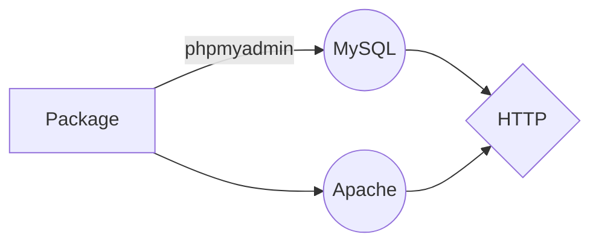

#  BrazilJS Portal Theme

Neque porro quisquam est qui dolorem ipsum quia dolor sit amet, consectetur, adipisci velit...

# Dependências

1. Apache2
2. MySQL
3. Phpmyadmin

# Duplicator Packages

1. If Gulp is not installed, install [Gulp](http://gulpjs.com/).
2. Inside Your project folder run the command "npm install" in the terminal.
3. To start using the theme development, run the command "gulp" in the terminal.
4. To build the necessary assets for production environment, use the command "gulp build" in the terminal.

## Deploy
rsync -r --exclude=node_modules/ --exclude=.git ./ braziljs-wp:/var/www/html/wp-content/themes/portal-wp-theme-master/